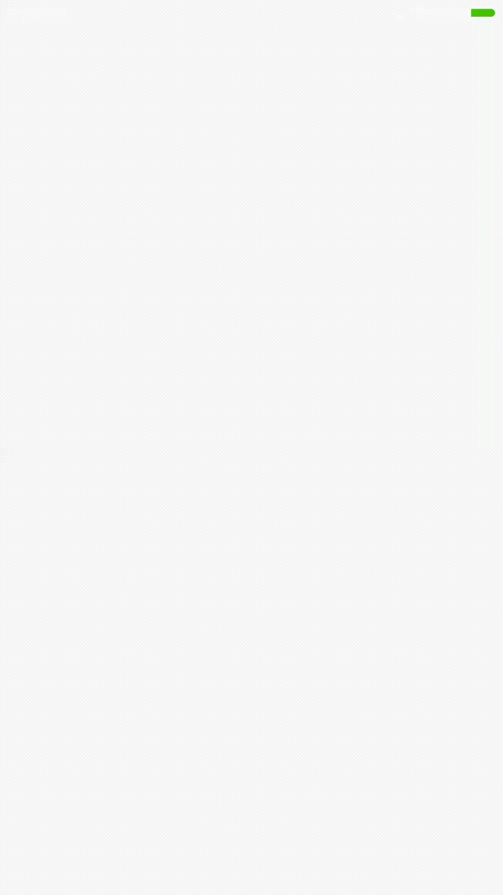

# SimpleSplashScreen

## Provide a simple splash screen animation (use of demo)



## dependencies

```
compile 'com.hd.splashscreen:splashscreen:1.0'
```

## in layout xml:

```
<com.hd.splashscreen.SimpleSplashScreen
    android:id="@+id/simpleSplashScreen"
    android:layout_width="match_parent"
    android:layout_height="match_parent"/>
```

## in code:

```
override fun onResume() {
    super.onResume()
    simpleSplashScreen.addConfig(getSimpleConfig(25f))
    simpleSplashScreen.start()
}

private fun getSimpleConfig(size:Float=30f): SimpleConfig {
    val simpleConfig = SimpleConfig()
    simpleConfig.text = "SIMPLESPLASHSCREEN"
    simpleConfig.textColor = R.color.colorAccent
    simpleConfig.textSize = size
    simpleConfig.iconId = R.mipmap.ic_launcher
    simpleConfig.iconDelayTime=800
    simpleConfig.callback=this
    return simpleConfig
}

override fun loadFinish() {
       Toast.makeText(this,"load completed",Toast.LENGTH_SHORT).show()
   }
```