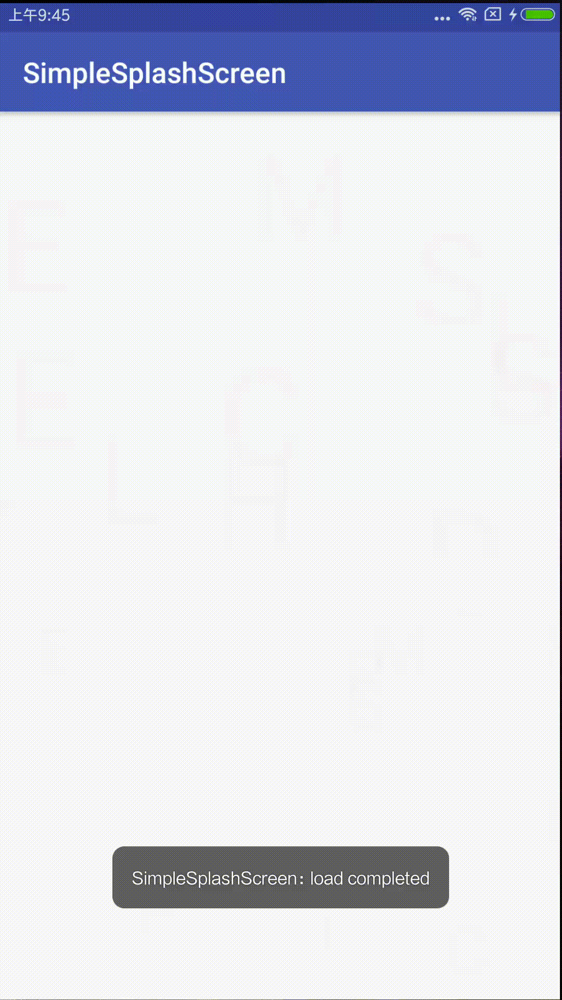

# SimpleSplashScreen

## Provide a simple splash screen animation (use of demo)

## dependencies

```
compile 'com.hd.splashscreen:splashscreen:1.4'
```

## screenshot:

 

## use about text view:

#### in xml:
```
 <com.hd.splashscreen.text.SimpleSplashScreen
        android:id="@+id/horizontalScreen"
        android:layout_width="match_parent"
        android:layout_height="match_parent"
        android:orientation="horizontal"/>
```

#### code (default usage):

```
  horizontalScreen.start();
```